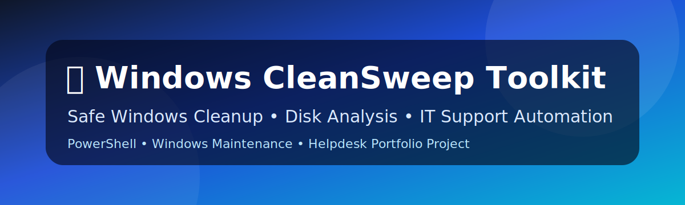

<div align="center">



<br />

# 🧹 Windows CleanSweep Toolkit

### ✨ Safe Windows Cleanup, Disk Analysis & Maintenance Toolkit for IT Support

<br />


<br />

**A practical Windows cleanup toolkit inspired by real IT Support troubleshooting scenarios.**  
Scan disk usage, identify common junk files, review cleanup targets and safely remove selected temporary data.

</div>

---

## 📌 Project Overview

**Windows CleanSweep Toolkit** is a PowerShell-based Windows maintenance project designed for:

- 🖥️ IT Support technicians
- 🧰 Helpdesk engineers
- 🛠️ Desktop Support teams
- 🧪 Windows lab practice
- 📁 GitHub portfolio demonstration

The toolkit focuses on safe, explainable cleanup rather than blindly deleting files.

---

## ✨ Key Features

| Feature | Description |
|---|---|
| 🔍 Scan Mode | Scans common Windows junk locations and creates reports |
| 🧹 Safe Cleanup | Deletes only conservative temporary files older than selected days |
| 📊 Reports | Generates CSV and HTML cleanup reports |
| 🗂️ Windows Update Cache Check | Reports SoftwareDistribution cache size |
| 🌐 Browser Cache Check | Reports Chrome, Edge and Firefox cache locations |
| 💥 Crash Dump Check | Finds memory dump and minidump files |
| 📦 Downloads Review | Detects large files in Downloads for manual review |
| 🔗 Broken Shortcut Scan | Finds broken `.lnk` files on Desktop and Start Menu |
| 🚀 Startup Review | Lists current user startup items |
| 🧑‍💻 Developer Cache Option | Optional scan for npm, pip and NuGet caches |

---

## 📁 Repository Structure

```text
windows-system-cleanup-toolkit/
├── assets/
│   ├── banner.svg
│   └── screenshots/
├── config/
│   └── cleansweep.config.json
├── docs/
│   ├── CLEANUP-CHECKLIST.md
│   ├── SAFETY.md
│   └── TROUBLESHOOTING.md
├── scripts/
│   ├── CleanSweep.ps1
│   └── Run-CleanSweep.bat
├── .github/
│   └── workflows/
│       └── powershell-syntax-check.yml
├── CHANGELOG.md
├── CONTRIBUTING.md
├── LICENSE
├── SECURITY.md
└── README.md
```

---

## 🚀 Quick Start

### Option 1: Run PowerShell directly

```powershell
cd scripts
.\CleanSweep.ps1 -ScanOnly
```

### Option 2: Run safe cleanup

```powershell
.\CleanSweep.ps1 -Clean -OlderThanDays 3
```

### Option 3: Run from batch menu

Double-click:

```text
scripts\Run-CleanSweep.bat
```

---

## 🛡️ Safety First

This project is designed with conservative cleanup rules:

- ✅ Scan-first workflow
- ✅ Cleanup requires confirmation
- ✅ Only old temp files are deleted automatically
- ✅ User documents are not deleted
- ✅ Downloads folder is reported only, not deleted
- ✅ Windows system folders are excluded

Read more: [Safety Guide](docs/SAFETY.md)

---

## 📊 Report Output

Reports are saved under:

```text
reports/
```

Example outputs:

```text
CleanSweep_Report_20260710_102030.csv
CleanSweep_Report_20260710_102030.html
```

---

## 🧪 Example Commands

```powershell
# Scan only
.\scripts\CleanSweep.ps1 -ScanOnly

# Clean temp files older than 7 days
.\scripts\CleanSweep.ps1 -Clean -OlderThanDays 7

# Include developer caches in scan report
.\scripts\CleanSweep.ps1 -ScanOnly -IncludeDeveloperCaches
```

---

## 🧰 IT Support Use Cases

- Windows C: drive nearly full
- User profile temp files are too large
- Browser cache consuming disk space
- Windows Update leftovers investigation
- Post-incident cleanup checklist
- Before/after disk maintenance report
- Desktop Support automation practice

---

## ⚠️ Disclaimer

Use this toolkit carefully. Always review scan results before cleanup. Test in a lab environment before using on production machines.

---

## 👤 Author

**Xuan Toan Nguyen**  
IT Support | System Administration | Cloud & Windows Labs  
Adelaide, South Australia  

- LinkedIn: [toan-nguyen-it-oz](https://www.linkedin.com/in/toan-nguyen-it-oz)
- GitHub: [toannguyenitoz](https://github.com/toannguyenitoz)

---

<div align="center">

⭐ If this repo helps you, consider giving it a star.

**#ToanNguyenITOz**

</div>
